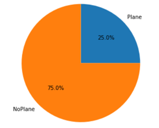
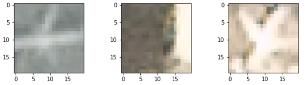
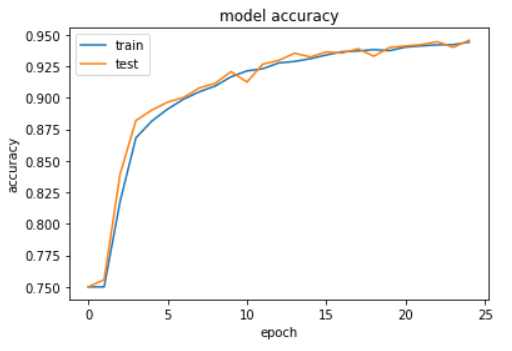
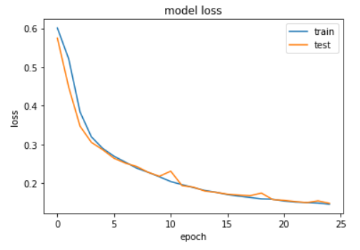

# Plane Detection Model Using Satellite Imagery
Planet labs which is a satellite imagery provider provides observation imagery of Earth’s on a daily basis. These imageries supply crucial information to various industries. By using imageries and AI, daily problems can be solved better than before. The aim of this project is to identify airplanes in satellite images. This project can be beneficial for monitoring airports for activity and traffic patterns, and defense intelligence.

## Data

This dataset is from Kaggle which was made available through Planet's Open California dataset, openly licensed. Data content: 

**label:** Valued 1 representing the "plane" class, valued 0 representing the "no-plane" class.
**scene id:** The unique identifier of the PlanetScope visual scene the image chip was extracted from. The scene id can be used with the Planet API to discover and download the entire scene. 
**longitude_latitude:** The longitude and latitude coordinates of the image center point, with values separated by a single underscore.

## DATA CLEANING AND WRANGLING 

This dataset includes 32000 20x20 RGB images labeled with either a "plane" or "no-plane" classification. The pixel value data for each 20x20 RGB image is stored as a list of 1200 integers within the data list. The first 400 entries contain the red channel values, the next 4400 the green, and the final 400 the blue. All features were examined to be ready for the next steps. Dataset shape, feature types were checked. Data includes 32000 images and every image is represented as a vector of length 1200 elements. 

**Convert data from list to array:** Data and labels were converted to an array. The ratios of two classes, ships or no ships are shown in Figure 1.

|  |
|:--:|
| **Figure 1.** `The class ratios. Number of plane is 8000; The Number of no-plane is 24000. The class imbalance in the model was addressed in the following steps` |

### Reshaping the data
As we know, the dataset contains 32000 images. In this step, each image was represented as a vector of length 1200 elements, containing 3 layers (R, G, B) and 20x20 which is weight and height. Then the axes in the input images were transposed to the specified order, i.e., transpose function reversed the order of the dimensions. 

## PRE-PROCESSING 
Images were normalized to the range of 0-1 by divided 255 to be ready for modeling. The ‘labels’ was one hot encoded by using to_categorical from Keras. This removes any unnecessary bias in the dataset. The dataset was splitted to test and train sets as 0.8 for training and 0.2 for the test. Some Examples of image data we have are shown in Figure 2.

|  |
|:--:|
| **Figure 2.** `The examples of satellite imagery data we have in this project` |

## MODELING 

In this part, Keras Sequential method was used with data augmentation.

Data augmentation is used to increase the amount of data by adding slightly modified copies of already existing data. It acts as a regularizer and helps reduce overfitting when training a machine learning model. In this project, rotation_range, horizontal_flip, vertical_flip were used since they fit with the problem domain. 
 
* __Conv2D:__ determines the number of kernels, which has a height and width, to convolve with the input volume. Operations produce a 2D activation map. The first required Conv2D parameter is the number of filters that the convolutional layer will learn. The filter is systematically applied to the input data to create a feature map. 

* __MaxPooloing2D:__ downsamples the input representation, i.e., reduces the dimensionality of images by reducing the number of pixels in the output from the previous convolutional layer. 

* __Activation:__ rectified linear activation function or ReLU is a piecewise linear function that will output the input directly if it is positive, otherwise, it will output zero.

The model has three blocks with different convolution layer filters: 

The first layer is a 2-dimensional convolution layer with 32 filters (filter size 3x3), that has an input of 20 x 20 x 3 dimensions with relu activation function and followed by a 2-dimensional max-pooling layer with 2 by 2 kernel size. 

The second 2-dimensional convolution layer has 64 filters, and the third one 64 filters. And followed by a 2-dimensional max-pooling layer with 2 by 2 kernel size. 

Flatten layer which converts the feature map produced by the convolutional layers into a single column. Flatten layer followed by hidden layers of 512 and 126 neurons with a ReLU activation function. 

Finally, an output layer of 2, for the probability that an input image belongs to either class plane or class no-plane. The accuracy with data augmentation is 94%. The accuracy and loss have good fit learning curves (see Figure 3)

<table align = "center">
<thead>
  <tr>
    <th> </th>
    <th></th>
  </tr>
</thead>
<tbody>
  <tr>
      <td colspan="2"; align = "center"><b>Figure 3 :</b> The accuracy and loss function curves. The test and train curves keeps increasing at the same rate until the max epoch the model is trained </td>
  </tr>
</tbody>
</table>
